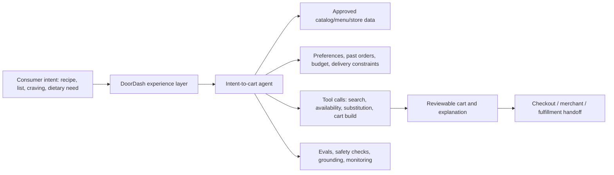

# OpenAI SDR DoorDash Loom Case Fallback

Navigation: [[OpenAI-SDR-master-interview-prep-checklist]] | [[OpenAI-SDR-DoorDash-Loom-final-canonical-document]] | [[OpenAI-SDR-DoorDash-Loom-current-strategy-script]] | [[OpenAI-SDR-Loom-finalization-control-room]] | [[OpenAI-SDR-Loom-case-package]] | [[OpenAI-SDR-case-study-playbook]] | [[OpenAI-Loom-project-prompt-Stanley-2026-06-27]]

Internal fallback case if Seth receives the same DoorDash strategic-customer prompt that Stanley received.

## Read This First

- Canonical DoorDash recording doc: [[OpenAI-SDR-DoorDash-Loom-final-canonical-document]].
- If the Loom includes the live Dasher reactivation voice demo, use [[OpenAI-SDR-DoorDash-Loom-final-canonical-document]] as the primary DoorDash case.
- Treat [[OpenAI-SDR-DoorDash-Loom-current-strategy-script]] as source/reference only.
- Use this page as the secondary DoorDash fallback for the consumer commerce / intent-to-cart angle.
- If the prompt is open-choice and Seth prefers APAC/regulatory depth, [[OpenAI-SDR-Loom-case-package]] / IHH remains the stronger differentiated track.
- This is not a final submission. Recheck all DoorDash facts before recording.
- Do not claim DoorDash is not already using AI. Public sources show multiple AI initiatives and a DoorDash app in ChatGPT.
- Pitch the next strategic workflow, not a generic "add AI" idea.

## Current Public Source Baseline

Checked 2026-06-29.

| Fact | Source | Case use |
|---|---|---|
| DoorDash describes itself as one of the world's leading local commerce platforms, expanded to over 30 countries, with Marketplace and Commerce Platform surfaces. | [DoorDash investor relations overview](https://ir.doordash.com/overview/default.aspx) | Establish multi-sided local-commerce scale. |
| Q1 2026 Total Orders were 933 million, Marketplace GOV was USD 31.6B, revenue was USD 4.0B, and Adjusted EBITDA was USD 754M. | [DoorDash Q1 2026 results](https://ir.doordash.com/news/news-details/2026/DoorDash-Releases-First-Quarter-2026-Financial-Results/default.aspx) | Establish scale and business pressure. |
| Q1 2026 growth included Deliveroo integration and international marketplace dynamics. | [DoorDash Q1 2026 results](https://ir.doordash.com/news/news-details/2026/DoorDash-Releases-First-Quarter-2026-Financial-Results/default.aspx) | Support global/localization complexity. |
| FY2025 DoorDash generated nearly USD 75B in sales for local merchants across 40+ countries and over USD 20B in earnings for Dashers. | [DoorDash FY2025 results](https://ir.doordash.com/news/news-details/2026/DoorDash-Releases-Fourth-Quarter-and-Full-Year-2025-Financial-Results/default.aspx) | Establish multi-stakeholder value. |
| DoorDash launched a grocery shopping app within ChatGPT in December 2025, enabling users to turn recipes into grocery orders and check out on DoorDash. | [DoorDash OpenAI announcement](https://about.doordash.com/en-us/news/openai) | Critical proof that OpenAI is already a strategic adjacency. |
| DoorDash says the ChatGPT grocery app uses DoorDash's grocery selection and on-demand logistics network, with selection across national and regional grocers. | [DoorDash OpenAI announcement](https://about.doordash.com/en-us/news/openai) | Use as land-and-expand signal, not as a net-new idea. |
| DoorDash launched Ask DoorDash, a conversational search/shopping experience that can build carts from recipes, grocery lists, past orders, preferences, and restaurant intent. | [Ask DoorDash announcement](https://about.doordash.com/en-us/news/ask-doordash) | Shows current direction toward conversational commerce. |
| DoorDash introduced AI-powered merchant onboarding tools that can help merchants launch more than 35% faster by surfacing photos, hours, and menu items from existing online presence. | [AI merchant tools](https://about.doordash.com/en-us/news/ai-powered-merchant-tools) | Merchant operations wedge. |
| Dash Forward 2025 highlighted AI-powered recommendations, smart tags, and Complement Your Cart. | [Dash Forward 2025](https://about.doordash.com/en-us/news/dash-forward-2025) | Shows consumer discovery and personalization direction. |

## Case Thesis

### One-Sentence Thesis

> DoorDash should use OpenAI to move from AI-assisted search and merchant setup into an agentic local-commerce layer that turns consumer intent, merchant data, and operational constraints into reliable carts, better catalog quality, and measurable conversion.

### Three-Year AI Point Of View

> Over the next three years, DoorDash's AI opportunity is not only "better recommendations." It is to become the agentic interface for local commerce: consumers express intent in natural language or images, merchants keep menus/catalogs accurate with less work, and DoorDash orchestrates the right items, substitutions, timing, and fulfillment path across restaurant, grocery, retail, and international markets.

### Why This Is Not Generic

- DoorDash already has public AI momentum: ChatGPT grocery app, Ask DoorDash, merchant onboarding, recommendations, smart tags, and cart complements.
- The next step should connect those initiatives into a measurable workflow with stronger grounding, evals, merchant review, and operational handoff.
- OpenAI should be framed as an acceleration and orchestration layer, not a replacement for DoorDash's internal ML.

## Recommended Use Case

### Local Commerce Intent-To-Cart Agent

Start with one wedge:

> A multimodal intent-to-cart agent that converts recipes, shopping lists, dietary preferences, occasion planning, and reorder intent into a reviewable cart across grocery, restaurant, and retail, while preserving merchant catalog accuracy, substitution logic, and fulfillment constraints.

Why this wedge:

- Consumer value: less search fatigue, faster cart creation, more personalized discovery.
- Merchant value: better menu/catalog quality, better item context, fewer abandoned orders due to confusing options.
- DoorDash value: higher conversion, larger baskets, better cross-category engagement, more DashPass stickiness.
- OpenAI fit: multimodal understanding, conversation, tool calls, retrieval, structured outputs, evals, and human/merchant review loops.

## How It Might Work

Keep the architecture seller-safe:

OpenAI surfaces to evaluate:

| Need | OpenAI surface | Why |
|---|---|---|
| Natural language and multimodal intent | Current model selected after evals | Recipes, photos, lists, preferences, and fuzzy cravings need language and image understanding. |
| Catalog and policy grounding | Retrieval / File Search pattern | Answers should use current DoorDash and merchant data, not generic food knowledge. |
| Cart and substitution actions | Function calling / tools | The model should call bounded DoorDash systems for item search, availability, substitution, and cart creation. |
| Reliable cart schema | Structured outputs | Makes handoff to checkout and internal systems consistent. |
| Quality and regression monitoring | Evals / tracing | Tests conversion, bad substitutions, hallucinated items, allergy/dietary edge cases, and user trust. |
| Merchant/user review | Human review / approval surfaces | Merchants and users should review high-impact or uncertain changes before commitment. |

Do not say:

- "OpenAI will own DoorDash's search stack."
- "The agent can autonomously decide all substitutions."
- "This solves allergies or regulated food-safety risk."
- Exact model names, prices, latency, or region claims without current verification.

## 30-Day Executive Engagement Plan

| Period | Objective | Stakeholders | Output |
|---|---|---|---|
| Days 1-5 | Build account thesis from public product launches, Q1 2026 results, ChatGPT app, Ask DoorDash, merchant AI tools, and Dash Forward signals. | OpenAI AD, Seth, account research. | Source-backed POV and disallowed-claims list. |
| Days 6-10 | Align with OpenAI AD on wedge and proof boundaries. | OpenAI AD, solutions/product support if available. | Approved talk track: OpenAI as workflow acceleration, not "replace DoorDash ML." |
| Days 11-15 | Open with commerce/product or grocery/retail discovery owner. | Product, grocery/retail, consumer discovery, merchant product. | Discovery around cart conversion, search fatigue, catalog quality, and substitution pain. |
| Days 16-22 | Multi-thread platform and governance validators. | ML/platform, data/privacy, trust/safety, merchant operations, international/localization. | Risk map and POC feasibility questions. |
| Days 23-30 | Propose narrow POC. | Champion, economic buyer, technical validators, AD. | POC with one category, measurable conversion/basket/catalog-quality metrics, and review gates. |

## Outbound Message

Subject: DoorDash's next AI commerce workflow

Hi {{FirstName}},

I saw DoorDash has already moved quickly on AI commerce: the ChatGPT grocery app, Ask DoorDash, AI merchant onboarding, recommendations, smart tags, and cart complements.

One workflow that seems worth pressure-testing is the next step after search: turning recipe/list/craving intent into a grounded, reviewable cart that respects merchant catalog data, user preferences, substitutions, and fulfillment constraints.

Would it be useful to compare where OpenAI could help DoorDash evaluate that as a narrow POC, with clear conversion, basket, and catalog-quality metrics?

Best,  
Seth

## Risks And Containment

| Risk | Why it matters | Containment |
|---|---|---|
| Hallucinated products or wrong availability | Bad user trust and operational friction. | Ground on DoorDash catalog/inventory systems; use tools, source evidence, and evals. |
| Allergy, dietary, or safety-sensitive errors | High consequence if recommendations are wrong. | Avoid medical/safety claims, show evidence, add user review, and restrict autonomous substitutions. |
| Merchant catalog inaccuracies | Poor cart quality and merchant trust issues. | Merchant review loops, confidence thresholds, and catalog-quality feedback. |
| Internal ML overlap | DoorDash already has strong AI/ML. | Position OpenAI as a workflow acceleration and evaluation partner, not a replacement. |
| International/localization complexity | DoorDash operates across many markets and acquired/integrated assets. | Start in one category/market, then expand after measured proof. |
| Privacy and data handling | Personalization depends on sensitive user/context signals. | Validate data boundaries with DoorDash privacy/security and OpenAI official documentation. |

## Why OpenAI

Do not lead with "better model."

Use this:

> The OpenAI case is breadth across multimodal reasoning, conversation, tool use, structured outputs, retrieval-style grounding, evals, and enterprise workflow design. DoorDash already has AI momentum. The question is whether OpenAI can help turn that momentum into a more reliable agentic commerce workflow with clear metrics and review boundaries.

## Standout Close

> What I would do differently is not pitch a generic AI assistant. I would start from DoorDash's own public AI roadmap, identify the next measurable workflow after Ask DoorDash and ChatGPT grocery checkout, map the product/ML/privacy/merchant stakeholders, and ask for a narrow proof exercise around conversion, basket quality, catalog quality, and trust.

## Interview Follow-Up Answers

| Question | Answer spine |
|---|---|
| Why DoorDash? | Official prompt names DoorDash; current public materials show huge local-commerce scale and live AI commerce momentum. |
| Why this use case? | It builds directly on DoorDash's AI direction while creating measurable consumer, merchant, and platform value. |
| Is DoorDash already doing this? | Yes, and that is the point. OpenAI should land where DoorDash already has momentum and help expand a specific workflow, not invent a disconnected demo. |
| Why not merchant onboarding instead? | Merchant onboarding is also strong. I would choose intent-to-cart because it touches consumer conversion, merchant catalog quality, and cross-category expansion; merchant onboarding can be a second wedge. |
| What is the first metric? | Cart conversion from AI session, basket size/order value, substitution quality, user edit rate, catalog issue detection, repeat usage. |
| Who would you target first? | Product/grocery-retail/discovery champion first; then ML/platform, privacy/security, merchant ops, and economic owner. |

## Evidence Ledger

| Claim | Status | Source |
|---|---|---|
| DoorDash is a global/local-commerce platform across 30+ countries. | Current official baseline | [DoorDash investor relations overview](https://ir.doordash.com/overview/default.aspx) |
| Q1 2026 orders/GOV/revenue/Adjusted EBITDA figures. | Current official baseline | [DoorDash Q1 2026 results](https://ir.doordash.com/news/news-details/2026/DoorDash-Releases-First-Quarter-2026-Financial-Results/default.aspx) |
| FY2025 merchant sales and Dasher earnings figures. | Current official baseline | [DoorDash FY2025 results](https://ir.doordash.com/news/news-details/2026/DoorDash-Releases-Fourth-Quarter-and-Full-Year-2025-Financial-Results/default.aspx) |
| DoorDash app in ChatGPT exists. | Current official baseline | [DoorDash OpenAI announcement](https://about.doordash.com/en-us/news/openai) |
| Ask DoorDash exists with recipe/list/cart and restaurant-intent capabilities. | Current official baseline | [Ask DoorDash announcement](https://about.doordash.com/en-us/news/ask-doordash) |
| AI merchant onboarding can help merchants launch more than 35% faster. | Current official baseline | [AI merchant tools](https://about.doordash.com/en-us/news/ai-powered-merchant-tools) |
| Dash Forward 2025 AI recommendations, smart tags, Complement Your Cart. | Current official baseline | [Dash Forward 2025](https://about.doordash.com/en-us/news/dash-forward-2025) |
| Exact current model, pricing, latency, residency, or contract terms. | Not verified | Do not say without current OpenAI and account-specific confirmation. |

## Open Gaps

- [ ] Recheck DoorDash facts immediately before recording.
- [ ] Confirm whether Seth's actual prompt names DoorDash.
- [ ] If prompt asks for a deck, adapt `docs/share/OpenAI-SDR-IHH-Loom-case-deck-template.pptx` structure into DoorDash visuals.
- [ ] If prompt is open-choice, decide whether DoorDash or IHH gives Seth the stronger story.
- [ ] Time the DoorDash version to 7 minutes.
