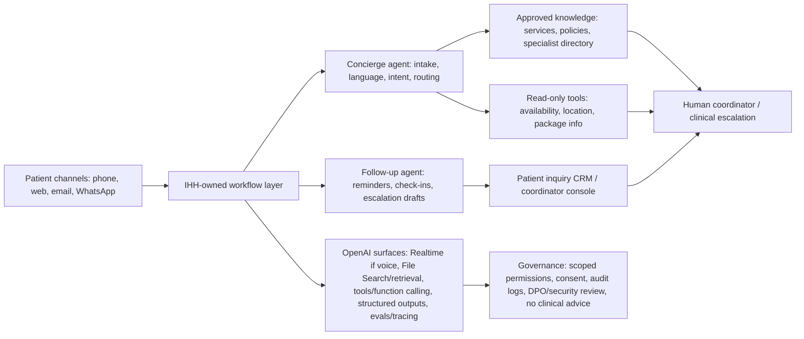

# OpenAI SDR Loom Case Package

Navigation: [[OpenAI-SDR-master-interview-prep-checklist]] | [[OpenAI-SDR-Loom-part-1-general-talk-track]] | [[OpenAI-SDR-Loom-finalization-control-room]] | [[OpenAI-SDR-DoorDash-Loom-case-fallback]] | [[OpenAI-SDR-case-study-playbook]]

Internal case package for Seth's OpenAI Strategic Business Development Representative - APAC Loom/project round.

This page turns [[OpenAI-SDR-case-study-playbook]], the Stanley Loom prompt, the passed IHH specimen, Seth's motivation package, the product fluency pack, and the APAC prospecting pack into a usable deck/script package.

## Read This First

- Status: `Drafted`, not `Ready`.
- This page is internal. Do not screen-share it. It contains friend-reported process intelligence, private prep links, and non-final case reasoning.
- The general Part 1 Loom opener now lives in [[OpenAI-SDR-Loom-part-1-general-talk-track]]. Use this page for the account-case section after the intro.
- Seth's actual Loom prompt is still unknown. The package below is a reusable case system, not a final submission.
- If Seth's prompt names DoorDash or another assigned customer, use this structure and rebuild the company facts.
- If Seth can choose a strategic customer, default to the IHH Healthcare track below because it is APAC, regulated, current, and has a strong passed-case specimen.
- Do not reuse outdated friend-case facts. The friend specimen says 80 hospitals and uses model/product claims that need verification. Current IHH public materials reviewed on 2026-06-29 say 89 hospitals in 10 countries.
- Do not say `gpt-5.2` as the recommended model, storage residency, inference location, healthcare compliance, OpenAI Frontier as a product/SKU, or clinical-liability claims unless verified from current official OpenAI sources and confirmed with the team.
- As of the 2026-06-29 verification refresh in [[OpenAI-SDR-comprehensive-answer-expansion-bank]], the seller-safe case language is to choose the current model/surface after evals for accuracy, latency, cost, language quality, workflow risk, and governance. Avoid exact model IDs in the Loom deck unless the prompt explicitly requires them.

## Readiness Snapshot

| Artifact | Status | Priority | Current gap |
|---|---|---:|---|
| Prompt decision tree | Drafted | P0 | Needs Seth's actual prompt. |
| 6-slide deck outline | Drafted | P0 | Needs conversion into slides. |
| 7-minute script | Drafted | P0 | Needs timing rehearsal. |
| IHH account facts | Drafted | P0 | Recheck before submission; use only verified claims. |
| 3-year AI point of view | Drafted | P0 | Needs prompt/account confirmation. |
| Workflow wedge | Drafted | P0 | Needs final metrics and scope choice. |
| Technical architecture | Drafted | P0 | Needs final product-name verification before recording. |
| 30-day engagement plan | Drafted | P0 | Needs final target-persona names if useful. |
| Outbound message | Drafted | P0 | Needs account/persona personalization. |
| Vendor rubric | Drafted | P0 | Needs final wording cuts for time. |
| Why OpenAI / why not OpenAI | Drafted | P0 | Needs no-overclaim review. |
| Board-care answer | Drafted | P1 | Needs a 20-second backup version. |
| Model/product-choice defense | Drafted | P1 | Uses product surfaces, not unverified model names. |
| Submission packet | Drafted | P0 | Real Loom link, Ashby link, and deck PDF pending. |

## Prompt Decision Tree

| Actual prompt | What Seth should do |
|---|---|
| Assigned customer is DoorDash | Use the Stanley prompt requirements exactly. Rebuild account facts from current DoorDash primary sources. Use this page for deck shape, timing, 30-day plan, risk section, vendor rubric, and standout approach. Do not use IHH facts. |
| Assigned customer is another company | Keep the same 6-slide structure. Replace account facts, workflow wedge, personas, and outbound message. Reuse the technical/governance/risk architecture pattern. |
| Open choice | Use IHH Healthcare as the default APAC regulated-enterprise case, unless Seth wants a Singapore bank or digital platform instead. |
| Prompt asks for no deck | Use the deck as speaker notes. Still structure the Loom around the same 6 beats. |

## Default Open-Choice Account: IHH Healthcare

### Current Verified Facts To Use

Use these only after one final recheck before recording.

| Fact | Source | Use in case |
|---|---|---|
| IHH is one of the world's largest private healthcare providers, with an integrated network spanning 89 hospitals in 10 countries. | [IHH overview](https://www.ihhhealthcare.com/our-company/overview), [IHH reports page](https://www.ihhhealthcare.com/investors/reports-presentation/reports-and-presentations) | Establish scale and APAC/regulatory complexity. |
| IHH operates 190 healthcare facilities across 10 countries and employs about 76,000 skilled professionals. | [IHH homepage](https://www.ihhhealthcare.com/) | Establish operating scale beyond hospitals. |
| IHH's key markets include Malaysia, Singapore, Türkiye, and India, and it is listed on Bursa Malaysia and SGX. | [IHH overview](https://www.ihhhealthcare.com/our-company/overview) | Establish cross-border and Singapore/APAC relevance. |
| FY2025 core revenue grew 18% to RM26.2 billion on a constant-currency basis; reported revenue rose 6% to RM25.7 billion. | [IHH Group CEO message](https://www.ihhhealthcare.com/our-company/our-leadership/group-ceo-message) | Establish business scale without using old USD estimate. |
| IHH's strategy includes new care models, clinical excellence, and acceleration of digital and technological capabilities. | [IHH Group CEO message](https://www.ihhhealthcare.com/our-company/our-leadership/group-ceo-message) | Anchor the 3-year AI POV. |
| Medical tourism in Malaysia recorded double-digit growth in FY2025. | [IHH Group CEO message](https://www.ihhhealthcare.com/our-company/our-leadership/group-ceo-message) | Support the international-patient workflow wedge. |
| IHH has a multi-year digital transformation partnership with Virtusa to modernize technology platforms, improve patient experience, streamline workflows, and lower long-term cost of ownership. | [IHH digital transformation story](https://www.ihhhealthcare.com/newsroom/care-in-action/advancing-patient-centred-care-with-digital-transformation) | Shows AI/digital readiness and SI consideration. |
| IHH's Virtusa collaboration will explore GenAI and Agentic AI across patient care, hospital management, billing systems, and regulatory compliance. | [IHH Malaysia digital transformation story](https://www.ihhhealthcare.com/my/news-and-media/stories/advancing-patient-centred-care-with-digital-transformation) | Supports why-now and land-and-expand. |

### Claims To Avoid Or Rephrase

| Do not say | Safer phrasing |
|---|---|
| "IHH operates 80 hospitals." | "Current IHH public materials say 89 hospitals in 10 countries." |
| "IHH has US$6.2B revenue." | "IHH reported RM25.7B revenue in FY2025 and RM26.2B core revenue on a constant-currency basis." |
| "OpenAI will host this in Singapore." | "Deployment would need the data-protection, hosting, and processing model validated with OpenAI and IHH's DPO." |
| "The agent gives medical advice." | "The agent handles administrative coordination and escalates clinical questions to humans." |
| "Use gpt-5.2." | "Select the current OpenAI model/surface after testing accuracy, latency, cost, language quality, and governance requirements." |
| "OpenAI Frontier is essential." | "At scale, IHH would need an enterprise management plane for permissions, auditability, monitoring, and governance, whether through OpenAI enterprise capabilities, IHH systems, or partner implementation." |

## Case Thesis

### One-Sentence Thesis

> IHH should use OpenAI to build a multilingual international-patient concierge and follow-up workflow that turns cross-border patient demand into faster, more consistent, more governed care navigation without scaling coordinator headcount linearly.

### Three-Year AI Point Of View

> Over the next three years, the highest-value AI shift for IHH is not a generic hospital chatbot. It is a governed patient-operations layer across its network: AI that helps patients navigate care, helps coordinators handle complex multilingual workflows, and helps the organization scale digital transformation across markets while keeping clinical accountability, privacy, and human escalation explicit.

### Why This Use Case

- It is tied to IHH's scale across hospitals, countries, and patient journeys.
- It fits IHH's digital transformation direction with patient experience, workflow modernization, and lower long-term cost of ownership.
- It creates a revenue and capacity case, not only a cost-saving case.
- It is narrow enough for a controlled POC and broad enough to expand.
- It gives OpenAI a multi-stakeholder enterprise conversation: patient experience, operations, technology, data protection, clinical governance, and SI alignment.

## High-Impact Workflow Wedge

### Workflow

International patient inquiry, care navigation, and post-visit follow-up.

### Current Pain Hypothesis

International patients often need multilingual support, specialist matching, cost or package clarification, scheduling, medical-record intake, insurance or payment coordination, travel timing, and post-care follow-up. Much of that work is administrative but complex, cross-functional, and time-sensitive.

### Proposed Product

Build a multilingual patient concierge and follow-up agent that:

- handles inbound phone, web, email, or WhatsApp inquiries;
- captures patient intent and administrative context;
- retrieves approved information from IHH service, specialist, hospital, package, scheduling, and policy sources;
- drafts a recommended next step for a coordinator;
- routes clinical or high-risk questions to a human;
- creates follow-up reminders and post-visit check-ins;
- logs every action for review, audit, and improvement.

### Success Metrics

| Metric | Why it matters |
|---|---|
| Time to first response | Faster response can protect high-intent patient demand. |
| Qualified inquiry to appointment conversion | Connects the workflow to revenue and patient access. |
| Coordinator capacity | Shows whether AI reduces linear headcount scaling. |
| Escalation quality | Measures whether the agent knows when not to act. |
| Follow-up completion | Protects continuity and patient experience. |
| Patient satisfaction | Ensures automation does not feel like a downgrade. |
| Compliance review pass rate | Makes governance a success criterion, not an afterthought. |

### Land-And-Expand Path

1. International patient concierge and follow-up.
2. Domestic patient intake and care navigation.
3. Internal knowledge assistant for coordinators and operations staff.
4. Operations intelligence for capacity, demand, and routing.
5. Billing, claims, and revenue-cycle workflow support with human review.
6. Network-wide playbook for governed agent deployment across IHH markets.

## Six-Slide Deck Outline

### Slide 1: Why Me, Why OpenAI

Message:

> I am an APAC enterprise GTM operator who can help OpenAI turn AI interest into qualified enterprise opportunities by combining regulated-buyer sales experience, stakeholder mapping, and AI-native account intelligence.

Bullets:

- Airwallex: fintech/regulatory GTM, quota discipline, account prioritization.
- Boxo: enterprise platform partnerships, C-suite/product/engineering/legal/compliance stakeholders.
- Salescraft/GTM Workspace: source-backed AI account intelligence and seller handoff systems.
- Why OpenAI: the enterprise AI market is moving from pilots to governed deployment, and this role sits close to that motion.

Timing: 60-75 seconds.

### Slide 2: IHH Account POV

Message:

> IHH is a scaled APAC healthcare network where AI can move from isolated digital initiatives into governed patient-operations workflows.

Bullets:

- 89 hospitals in 10 countries; 190 healthcare facilities.
- Key markets include Malaysia, Singapore, Türkiye, and India.
- FY2025 scale: RM25.7B reported revenue; RM26.2B core revenue on a constant-currency basis.
- Current transformation agenda includes digital/technology acceleration and patient experience.
- Virtusa partnership creates both readiness and an implementation-stakeholder path.

Timing: 45-55 seconds.

### Slide 3: High-Impact Use Case

Message:

> Start with a multilingual international-patient concierge and follow-up workflow.

Bullets:

- Patient asks about a procedure from overseas.
- Agent captures intent, language, timing, admin context, and urgency.
- It retrieves approved service/specialist/hospital information.
- It drafts next steps, routes high-risk questions to human coordinators, and schedules follow-up tasks.
- Measures: response time, conversion, coordinator capacity, escalation quality, patient satisfaction.

Timing: 65-75 seconds.

### Slide 4: How It Works

Message:

> Keep the POC narrow, permissioned, observable, and human-reviewed.

Bullets:

- Channels: phone, web form, email, WhatsApp.
- Workflow layer: IHH-owned app plus OpenAI agent workflow where appropriate.
- OpenAI surfaces: Realtime for live voice if needed, File Search/retrieval for approved knowledge, function calling/tools for bounded actions, structured outputs for case handoff, evals/tracing for quality.
- Systems: service catalog, specialist directory, scheduling, CRM/patient inquiry database, policy knowledge base.
- Governance: scoped permissions, no diagnosis, consent, DPO/security review, audit logs, human escalation.

Timing: 65-75 seconds.

### Slide 5: 30-Day Executive Engagement Plan

Message:

> Earn credibility by leading with the workflow and buyer map, not with a generic AI demo.

Bullets:

- Days 1-5: build account thesis, source-backed workflow map, and stakeholder map.
- Days 6-10: align with OpenAI AD on approved claims, proof points, and first wedge.
- Days 11-15: target first champion in patient experience, international patient services, operations, or digital transformation.
- Days 16-22: bring in technology, DPO/security, clinical governance, and Virtusa/SI stakeholders.
- Days 23-30: run a discovery workshop and propose a POC with metrics, risk gates, and expansion path.

Timing: 65-75 seconds.

### Slide 6: Outreach, Risks, Why OpenAI, Standout Close

Message:

> The differentiated move is to act like this is the beginning of a real account plan.

Bullets:

- Outreach: short, specific, tied to IHH's digital transformation and patient operations.
- Risks: integration, patient trust, data/security/privacy, clinical accountability, SI alignment, TCO.
- Why OpenAI: not "better model," but breadth across API, agents, voice, retrieval, structured outputs, evals, enterprise trust layers, and product/workflow deployment.
- Standout: source-backed account intelligence, regulated-buyer judgment, stakeholder map, and first message Seth would actually send.

Timing: 70-85 seconds.

## Seven-Minute Script

### 0:00-1:10: Opening

> Hi, I am Seth. My background is APAC enterprise GTM across fintech, platform partnerships, and AI-native sales systems. The throughline is turning messy, technically complex buyer environments into qualified opportunities with a clear stakeholder map and business case.
>
> At Airwallex, I learned fintech GTM discipline and quota execution. At Boxo, I worked on enterprise platform partnerships where product, engineering, legal, compliance, and executive stakeholders all mattered. More recently, with Salescraft and GTM Workspace, I have been building source-backed account-intelligence and outbound systems using AI.
>
> That is why OpenAI is compelling to me. The Strategic BDR role is not a generic SDR role. It sits close to product signal, account strategy, discovery, and Account Director partnership. I am excited by the chance to help OpenAI turn enterprise AI interest into governed, high-impact deployments.

### 1:10-1:55: Account POV

> For the strategic customer, I would choose IHH Healthcare if the prompt allows an open choice. IHH is one of the world's largest private healthcare providers, with current public materials showing 89 hospitals in 10 countries and about 190 healthcare facilities. It has major markets across Malaysia, Singapore, Türkiye, and India, and it reported RM25.7 billion in FY2025 revenue.
>
> The account is interesting because it is both scaled and actively transforming. IHH has a digital transformation partnership with Virtusa focused on modernizing technology platforms, improving patient experience, streamlining workflows, and lowering long-term cost of ownership. That creates the right environment for a serious OpenAI conversation.

### 1:55-2:45: Three-Year AI POV

> My three-year point of view is that IHH should not think of AI as a generic chatbot layer. The bigger opportunity is a governed patient-operations layer across the network: AI that helps patients navigate care, helps coordinators manage complex multilingual workflows, and helps the organization scale digital transformation across markets while keeping clinical accountability and human escalation explicit.
>
> The first wedge I would choose is international patient inquiry, care navigation, and post-visit follow-up.

### 2:45-3:45: Use Case

> Imagine an international patient contacting IHH about cardiac care, oncology, or a specialist procedure. Today that journey can involve language support, medical-record intake, specialist matching, cost or package clarification, scheduling, insurance or payment coordination, and follow-up.
>
> I would build a multilingual patient concierge and follow-up agent for the administrative parts of that workflow. It would capture the patient's intent, retrieve approved service and specialist information, draft a next step for a coordinator, escalate clinical or high-risk questions to a human, and automatically create follow-up reminders.
>
> The business case is measurable: time to first response, qualified inquiry to appointment conversion, coordinator capacity, escalation quality, follow-up completion, and patient satisfaction.

### 3:45-4:45: Architecture

> Technically, I would keep the first POC narrow and governed. The patient channels could be phone, web, email, or WhatsApp. The workflow would sit in an IHH-owned application layer, with OpenAI used for the agentic workflow where appropriate.
>
> If live voice is critical, I would evaluate the Realtime API. For approved knowledge, I would use retrieval or File Search over vetted service information and policies. For system interactions, I would use function calling or tools, but start with read-only or draft actions before any write action. For handoff quality, structured outputs can create a clean case summary for a human coordinator.
>
> The governance layer matters as much as the AI layer: scoped permissions, audit logs, evals, monitoring, patient consent, data-protection review, and hard escalation rules for anything clinical or ambiguous.

### 4:45-5:45: 30-Day Executive Engagement Plan

> In the first 30 days, I would not lead with a demo. I would build an account thesis.
>
> Days one to five: map IHH's current transformation language, patient-operation priorities, and likely stakeholders. Days six to ten: align with the OpenAI Account Director on approved proof points, claims to avoid, and what would make this an AD-worthy opportunity. Days eleven to fifteen: start with the pain-owning champion, likely patient experience, international patient services, hospital operations, or digital transformation. Days sixteen to twenty-two: bring in technology, DPO/security, clinical governance, and the SI or Virtusa path early so risk does not appear late. Days twenty-three to thirty: propose a POC workshop with success metrics, risk gates, and expansion path.

### 5:45-6:25: Outbound Example

> My first message would be short and account-specific:
>
> "I saw IHH is modernizing technology platforms across key markets, with a focus on patient experience and clinical and hospital workflows. One question that seems worth exploring is whether international patient coordination can move from a manual, coordinator-heavy model to a governed AI-assisted workflow with clear human escalation. Would it be useful to compare where OpenAI could help IHH test that in a narrow POC?"

### 6:25-7:00: Risks, Why OpenAI, Standout Close

> The main risks are integration with hospital systems, patient trust, data and privacy review, clinical accountability, SI alignment, and TCO. Those risks are why I would keep the first workflow bounded.
>
> Why OpenAI is not just "better model." It is the breadth: API, agents, voice, retrieval, structured outputs, evals, and enterprise trust layers that can support both the builder and business-user sides of the account.
>
> What I would do differently is treat this like the beginning of a real account plan: source-backed account intelligence, stakeholder map, risk ledger, POC metric, and an outbound message I would actually send.

## Technical Architecture

### Product-Surface Rationale

| Need | OpenAI surface to evaluate | Why |
|---|---|---|
| Live phone interaction | Realtime API or transcription + response pipeline | Only if voice is essential; test latency, language, accents, and escalation. |
| Approved service and policy knowledge | File Search / retrieval | Keeps answers grounded in vetted IHH material rather than generic medical knowledge. |
| System lookups | Function calling / tools | Lets the workflow query approved systems with scoped permissions. |
| Clean coordinator handoff | Structured Outputs | Produces consistent case summaries and next-step fields. |
| Multi-step workflow | Agents SDK | Useful if IHH owns orchestration, tool execution, approvals, and state. |
| Quality management | Evals, tracing, monitoring | Tests language quality, escalation correctness, hallucination risk, and regression. |
| Enterprise readiness | Security, privacy, admin/usage controls | Required for DPO, security, procurement, and governance stakeholders. |

## 30-Day Engagement Plan

| Period | Primary objective | Stakeholders | Output |
|---|---|---|---|
| Days 1-5 | Build account thesis and verify facts. | OpenAI AD, Seth, account research. | One-page account POV, source ledger, workflow hypothesis. |
| Days 6-10 | Align on message, proof, and disallowed claims. | OpenAI AD, solutions/product support if available. | Approved talk track and risk boundaries. |
| Days 11-15 | Open with the pain-owning champion. | Patient experience, international patient services, hospital operations, digital transformation. | Discovery call focused on current workflow, metrics, and pain. |
| Days 16-22 | Multi-thread validators early. | Technology, DPO/security, clinical governance, procurement, Virtusa/SI path. | Feasibility map and risk register. |
| Days 23-30 | Co-design narrow POC. | Champion, economic buyer, technology/governance validators, AD. | POC scope, success metrics, data boundary, next meeting objective. |

### First Discovery Questions

- Where do international patient inquiries enter today, and how are they routed?
- Which languages, specialties, and markets create the most coordination load?
- What is the current time to first response and inquiry-to-appointment conversion?
- Which parts are administrative versus clinical?
- Which systems would the workflow need to read from, and which should remain human-only?
- What would the DPO/security team need before a POC?
- What would make the first POC commercially meaningful but safe?

## Outbound Message

Subject: International patient coordination at IHH

Hi {{FirstName}},

I saw IHH is modernizing technology platforms across key markets, with patient experience and hospital workflow improvement as major themes.

One workflow that seems worth exploring is international patient coordination: multilingual inquiry handling, specialist routing, appointment preparation, and post-care follow-up, with clear human escalation for anything clinical.

Would it be useful to compare where OpenAI could help IHH test a narrow, governed POC around that workflow?

Best,  
Seth

## Risks And Containment

| Risk | Why it matters | Containment |
|---|---|---|
| Hospital-system integration | Without access to approved systems, the workflow cannot be operational. | Start with read-only retrieval and draft handoffs before write actions. |
| Patient trust | Premium or older patients may reject a cold automated experience. | Use AI as concierge/coordinator support, offer human handoff, measure satisfaction. |
| Data/security/privacy | Healthcare workflows involve sensitive patient data and cross-border concerns. | DPO review, limited data scope, consent, retention policy, audit logs, current OpenAI/security review. |
| Clinical accountability | Administrative guidance can drift into clinical advice. | No diagnosis, no treatment advice, escalation rules, clinical-governance signoff, monitored transcripts. |
| SI/vendor alignment | Virtusa or other implementation partners may prefer other stacks. | Involve SI early, position OpenAI as platform/building block where it fits the architecture. |
| ROI/TCO | Board may reject an expensive bespoke build. | Start narrow, define conversion/capacity metrics, compare against SaaS/internal build options. |

## Vendor Evaluation Rubric

| Criterion | What IHH would test | OpenAI implication |
|---|---|---|
| Compliance and data controls | DPO/security approval, data processing, retention, auditability. | Do not overclaim; bring official security/privacy materials and technical validation. |
| Workflow accuracy | Language quality, correct routing, policy grounding, escalation correctness. | Use retrieval, structured outputs, evals, and human review. |
| Integration feasibility | Access to service catalog, scheduling, CRM/inquiry systems, coordinator workflow. | Start read-only and human-reviewed. |
| Business outcome | Response time, conversion, coordinator capacity, patient experience. | Tie POC to business metrics. |
| Total cost of ownership | Build cost, model/API usage, SI effort, maintenance, monitoring. | Use narrow POC and compare to alternatives. |
| Vendor/product stability | Roadmap, support, model lifecycle, enterprise readiness. | Keep claims current and route detail to OpenAI team. |
| SI alignment | Ability to work with Virtusa/IHH architecture. | Position as partner-friendly, not vendor-hostile. |
| Scale governance | Permissions, audit logs, monitoring, rollout controls. | Make governance part of the architecture from day one. |

## Why OpenAI

Use this answer if asked why OpenAI rather than another AI vendor.

> I would not lead with "OpenAI has the better model." The OpenAI reason is breadth and workflow fit. IHH would need voice or transcription if the channel is phone, retrieval over approved service and policy knowledge, tool calls into approved systems, structured outputs for clean human handoff, evals and monitoring for reliability, and enterprise trust controls for security, privacy, and governance. OpenAI can support a serious builder conversation across those layers, while still allowing IHH and its implementation partner to own the workflow and safety boundaries.

## Why IHH Might Not Choose OpenAI

| Objection | Strong answer |
|---|---|
| Healthcare data risk is too high. | Agree. That is why the first POC should be bounded, administrative, consented, logged, and reviewed by DPO/security before any patient-data deployment. |
| OpenAI is building blocks, not a complete healthcare concierge product. | True. That is a reason to choose a narrow build only if IHH's workflow is too network-specific for generic SaaS and if Virtusa/IHH can own implementation. |
| A vertical SaaS vendor has more healthcare proof. | Valid. The evaluation should compare proof, integration, TCO, compliance, and speed to value. OpenAI wins only if the workflow needs frontier reasoning, multilingual capability, and custom integration. |
| The SI prefers another stack. | Bring the SI in early. The goal is not to bypass implementation partners but to make the architecture work. |
| Patients may prefer human white-glove care. | The experience should preserve human handoff and use AI to improve responsiveness, not remove high-touch service. |

## Build-Vs-Buy Answer

> This is a build candidate only if IHH wants a network-specific workflow that spans multiple markets, languages, hospital systems, service packages, specialist directories, and human escalation rules. A vertical SaaS vendor may be better for a standardized workflow. The reason to build on OpenAI is if IHH wants differentiated patient navigation tied to its own systems and expansion path. I would make build-versus-buy part of the vendor evaluation rather than pretending it is obvious.

## Board-Care Answer

> A buying committee should care because this is not a novelty chatbot. It touches revenue conversion, capacity, patient experience, and the ability to scale a digital operating model across a large healthcare network. The board-level case is: can IHH capture more high-intent patient demand, reduce manual coordination pressure, and build a governed pattern for agent deployment that can expand into other workflows without creating unmanaged clinical or data risk?

## Model And Product Choice Defense

Use product-surface language, not unverified model-name language.

| Decision | Defense |
|---|---|
| Voice or not | Use voice only if phone/multilingual conversations are central. Otherwise start text-first for lower complexity. |
| Realtime versus transcription pipeline | Realtime fits live two-way calls; transcription plus structured follow-up can be simpler for async or coordinator-reviewed workflows. |
| Retrieval/File Search | Required because answers should use approved IHH service and policy knowledge, not generic model memory. |
| Function calling/tools | Use for bounded system lookups and draft actions. Start read-only before write actions. |
| Agents SDK | Use only if IHH owns multi-step orchestration, state, tools, approvals, and handoffs. |
| Structured outputs | Useful for reliable coordinator handoff fields and CRM/inquiry updates. |
| Evals/tracing | Mandatory to test language quality, routing, escalation, hallucination risk, and regression before scale. |
| Human review | Non-negotiable in healthcare; clinical ambiguity and high-value patient moments should escalate. |

## Standout Approach

> What I would do differently is not stop at a clever use case. I would bring a source-backed account thesis, a stakeholder map, a risk register, a POC metric, a build-versus-buy lens, and a first outbound message. That is how I think about this role: not activity volume, but creating the kind of first conversation that an Account Director can turn into a real enterprise opportunity.

Seth proof to mention:

- Boxo: enterprise platform partnerships and multi-stakeholder risk removal.
- Airwallex: fintech GTM discipline, regulated buyer context, quota and cadence.
- Salescraft/GTM Workspace: source-backed account intelligence, AI-assisted research, scoring, outbound drafts, CRM hygiene, seller handoffs.

## Loom Follow-Up Answers

| Question | Answer |
|---|---|
| Why IHH? | It is APAC, regulated, scaled, currently transforming digitally, and has a high-value patient-operations wedge. |
| Why this use case? | It is a bounded workflow where AI can affect response time, conversion, coordinator capacity, and patient experience without starting with clinical decision-making. |
| Why now? | IHH is actively modernizing technology platforms and exploring GenAI/agentic AI, while medical tourism and capacity expansion create operational pressure. |
| Who first? | Start with the pain owner in patient experience/international patient services/operations, then multi-thread technology, DPO/security, clinical governance, SI path, and executive sponsor. |
| Biggest risk? | Clinical/accountability drift and data privacy. That is why the POC must be administrative, scoped, logged, and human-reviewed. |
| First metric? | Time to first response and qualified inquiry-to-appointment conversion, paired with escalation quality. |
| What if they already use another AI vendor? | Treat it as a positive signal. Ask what is working, what remains unsolved, and whether OpenAI can land in a bounded workflow. |

## Critical Feedback Response

Use this if the reviewer challenges the case or says a part of the Loom was weak.

> That is fair feedback. The way I would think about it is: if the use case is too broad, I would narrow it to one workflow and one measurable metric. If the architecture is too ambitious, I would move more of it into a human-reviewed POC before any automated action. If the account thesis is weak, I would go back to primary sources and validate whether the business priority is actually live. I would not defend the deck for its own sake. The point is to turn it into a sharper account hypothesis an Account Director could use.

Shorter version:

> I would take that feedback seriously and tighten the case around the part that creates the most qualified opportunity: one workflow, one owner, one metric, one risk plan, and one credible next step.

## DoorDash Fallback Skeleton

If Seth receives the same DoorDash prompt as Stanley, use [[OpenAI-SDR-DoorDash-Loom-case-fallback]] as the detailed current-source spine. The table below is only the older high-level structure.

| Prompt requirement | DoorDash-safe starting point |
|---|---|
| 3-year AI POV | DoorDash should use AI to improve the local commerce operating system: better consumer support, merchant growth, Dasher operations, internal productivity, and logistics decisioning. |
| One use case | Pick one: merchant growth assistant, support resolution agent, Dasher operations copilot, or logistics exception-handling workflow. |
| First personas | GM/operations leader, merchant product/growth, customer experience/support, logistics, data/ML, trust/safety, privacy/security. |
| First 30 days | Account research, persona map, workflow hypothesis, discovery with pain owner, technical/governance validation, POC proposal. |
| Outbound | Tie to one operational bottleneck and one business metric; do not pitch generic AI. |
| Standout | Use source-backed account intelligence and a workflow-specific POC metric. |

Do not record the DoorDash version until Seth's actual prompt confirms DoorDash or allows it, and until current DoorDash facts and exact OpenAI product claims are rechecked.

## Submission Packet

Prepare this before deadline:

- [ ] Final Loom link with correct sharing permissions.
- [ ] Deck PDF export if using slides.
- [ ] Ashby assignment submission.
- [ ] Backup email to recruiter with Loom link and deck attachment if appropriate.
- [ ] Short note: "I submitted through the assignment link as requested and am attaching the deck for reference."
- [ ] Friend/trusted reviewer pass if timing allows.

### Backup Email Draft

Subject: OpenAI BDR APAC project submission - Seth Lim

Hi {{Recruiter}},

I have submitted the Loom through the assignment link. I am also sharing the Loom link here as a backup, along with the deck PDF for easier review.

Loom: {{link}}  
Deck: attached

Best,  
Seth

## Final Pre-Recording Checklist

- [ ] Actual prompt confirmed.
- [ ] Account choice confirmed.
- [ ] All company facts rechecked from primary/current sources.
- [ ] All OpenAI product/security/privacy claims rechecked from official OpenAI sources.
- [ ] Any healthcare/data/compliance claim reviewed and softened.
- [ ] Deck is 6 slides or fewer.
- [ ] Script is under 7 minutes.
- [ ] No Stanley facts remain.
- [ ] No friend/process-sensitive details appear.
- [ ] No unverified model names appear.
- [ ] First rehearsal recorded for timing.
- [ ] Final take uses natural delivery, not reading.
- [ ] Loom permissions checked.

## Evidence Ledger

| Claim | Status | Source |
|---|---|---|
| Stanley prompt asks for 7-minute Loom with 1-2 minute intro and 5-minute strategic-customer case. | Official-for-Stanley | [[OpenAI-Loom-project-prompt-Stanley-2026-06-27]] |
| Stanley prompt names DoorDash. | Official-for-Stanley | [[OpenAI-Loom-project-prompt-Stanley-2026-06-27]] |
| IHH is a strong structure model but not an official sample. | Friend-provided | [[IHH-Healthcare-case-study-response-2026-06-29]] |
| IHH currently reports 89 hospitals in 10 countries. | Current official | [IHH overview](https://www.ihhhealthcare.com/our-company/overview) |
| IHH currently reports 190 healthcare facilities and about 76,000 skilled professionals. | Current official | [IHH homepage](https://www.ihhhealthcare.com/) |
| FY2025 revenue and core revenue figures. | Current official | [IHH Group CEO message](https://www.ihhhealthcare.com/our-company/our-leadership/group-ceo-message) |
| Virtusa digital transformation / GenAI and Agentic AI exploration. | Current IHH pages | [IHH story](https://www.ihhhealthcare.com/newsroom/care-in-action/advancing-patient-centred-care-with-digital-transformation), [IHH Malaysia story](https://www.ihhhealthcare.com/my/news-and-media/stories/advancing-patient-centred-care-with-digital-transformation) |
| Agents SDK, File Search, Realtime, structured outputs, evals, security/privacy, model selection, and API data-control topics are OpenAI surfaces to evaluate. | Current official OpenAI docs baseline checked 2026-06-29 | [[OpenAI-SDR-comprehensive-answer-expansion-bank]] |
| Healthcare compliance, hosting, exact residency/inference region, clinical liability, and final model choice. | Not verified for live use | Do not say without current official/account-specific confirmation. |

## Open Gaps

- Seth's actual Loom prompt is still required before the final case can be `Ready`.
- The deck still needs to be created visually.
- The script still needs a timing pass and cuts.
- If the assigned account is not IHH, rebuild company facts and workflow wedge.
- If Seth uses IHH, recheck current facts immediately before recording.
